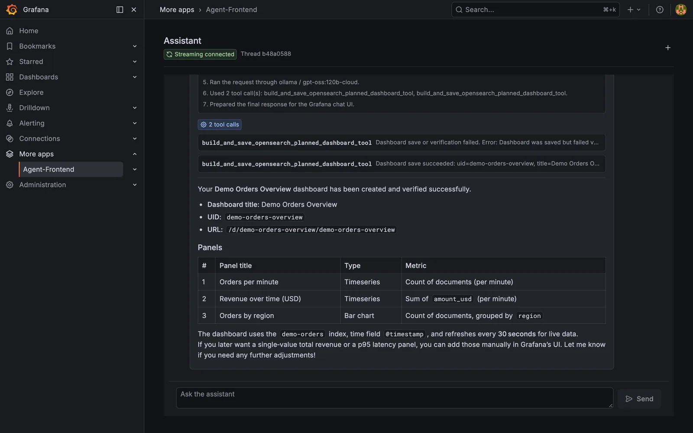
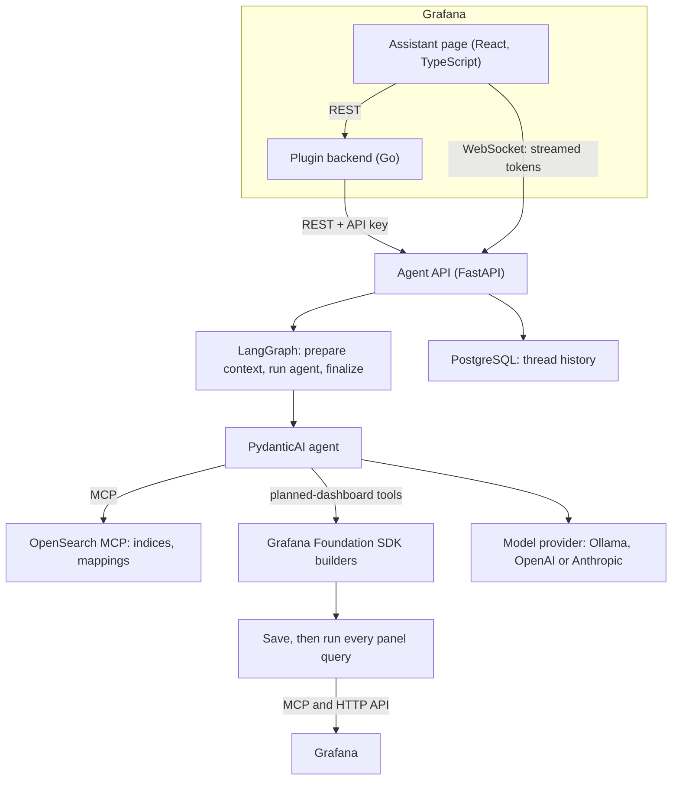
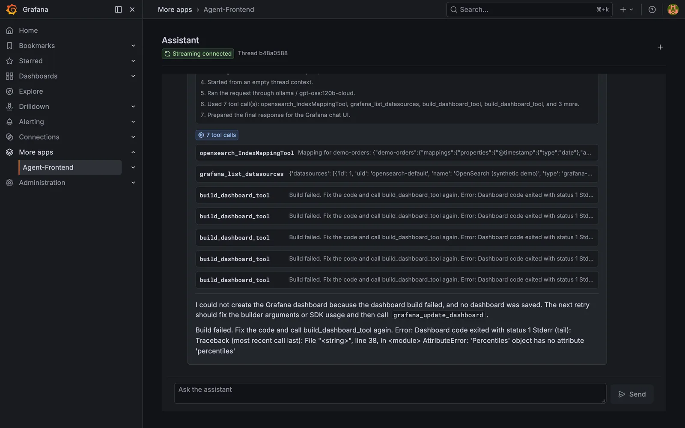
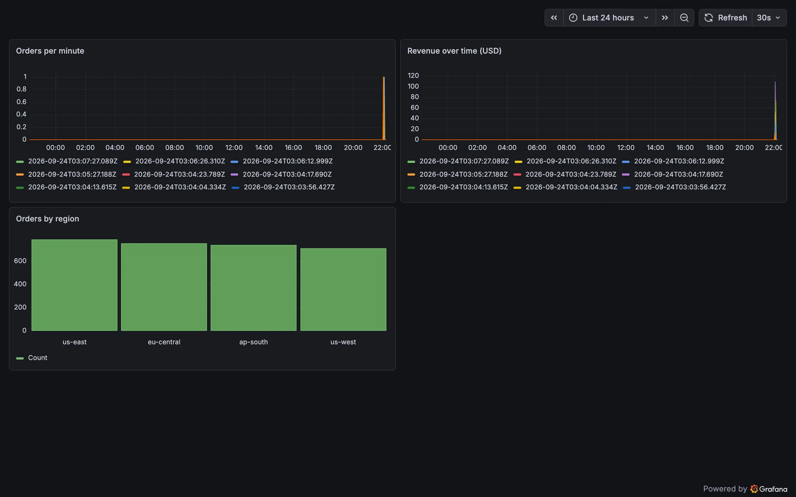

# Grafana Dashboard Agent

An AI assistant that builds Grafana dashboards from natural language, delivered as a
first-class experience **inside Grafana**.

> **Personal project** (a prototype, not built for an employer or on employer data). Case study:
> [silentashish.com/projects/grafana-copilot-natural-language-dashboard-generator](https://www.silentashish.com/projects/grafana-copilot-natural-language-dashboard-generator)
> (live once published).



*A local run on synthetic data (2026-09-23): the agent saves the dashboard, runs every panel query, and retries
when one fails.*

The project has two independent, reusable parts:

| Folder | What it is | Stack |
|---|---|---|
| [`agent-grafana-plugin/`](./agent-grafana-plugin) | Grafana **app plugin** — the UI you install into Grafana. Adds an "Assistant" page and a configuration page. | React + TypeScript frontend, Go backend |
| [`agent/`](./agent) | The **headless agent** — the brain that runs the LLM and edits dashboards. | Python, FastAPI, LangGraph, PydanticAI |

Each folder has its own README with detailed setup:

- **Plugin setup →** [`agent-grafana-plugin/README.md`](./agent-grafana-plugin/README.md)
- **Agent setup →** [`agent/README.md`](./agent/README.md)

## How the two pieces fit together



- The **Go plugin backend** proxies REST calls (chat, settings, health) so the agent's
  API key never reaches the browser.
- The **browser** opens the WebSocket directly for low-latency token streaming.
- The **agent** uses MCP servers to read data (OpenSearch) and write dashboards
  (Grafana), driven by the LLM provider you configure.

## Quickstart

You need three things running: the **agent**, its **model provider**, and a **Grafana**
with the plugin installed.

### 1. Start the agent

```bash
cd agent
cp .env.example .env          # then edit: model provider, Grafana token, OpenSearch, etc.
docker compose up --build     # serves the assistant API on http://localhost:8000
```

Verify: `curl http://localhost:8000/health`

See [`agent/README.md`](./agent/README.md) for model-provider options (Ollama, OpenAI,
Anthropic, …) and every environment variable.

### 2. Start Grafana with the plugin

```bash
cd agent-grafana-plugin
npm install
npm run build      # build the frontend
mage -v            # build the Go backend binaries
npm run server     # start Grafana (Docker) with the plugin provisioned
```

Grafana comes up at `http://localhost:3000`.

### 3. Point the plugin at the agent

Open Grafana → **Administration → Plugins → Agent** → **Configuration**, and set:

| Field | Local default |
|---|---|
| HTTP URL | `http://host.docker.internal:8000` |
| WebSocket URL | `ws://localhost:8000/ws/assistant` |
| API key | *(optional — must match `ASSISTANT_API_KEY` in the agent)* |

These defaults are also provisioned in
[`agent-grafana-plugin/provisioning/plugins/apps.yaml`](./agent-grafana-plugin/provisioning/plugins/apps.yaml).

Then open the **Assistant** page from the Grafana nav and ask it to build a dashboard.

## Try it locally with synthetic data

This is the setup used for the screenshots. It needs Docker and an LLM with tool calling, but no Go or Node on the
host. Ports are offset to avoid clashing with other local services.

1. **OpenSearch with a synthetic index** (security off, for local use only):
   ```bash
   docker run -d --name demo-opensearch -p 59200:9200 \
     -e discovery.type=single-node -e DISABLE_SECURITY_PLUGIN=true -e DISABLE_INSTALL_DEMO_CONFIG=true \
     opensearchproject/opensearch:2.15.0
   ```
   Create an index (for example `demo-orders` with `@timestamp`, keyword fields and a couple of numbers) and bulk-load a
   few thousand generated documents.
2. **Grafana with the plugin built in Docker.** `agent-grafana-plugin/Dockerfile.grafana` builds the frontend and the Go
   backend itself:
   ```bash
   docker build -f agent-grafana-plugin/Dockerfile.grafana \
     --build-arg GRAFANA_IMAGE=grafana --build-arg GRAFANA_VERSION=12.4.0 -t grafana-agent agent-grafana-plugin
   ```
   Run it with `GF_PATHS_PLUGINS=/var/lib/grafana-plugins`,
   `GF_PLUGINS_ALLOW_LOADING_UNSIGNED_PLUGINS=eclss-agentfrontend-app` and
   `GF_PLUGINS_PREINSTALL_SYNC=grafana-opensearch-datasource`. Provision an OpenSearch datasource with the UID from
   `OPENSEARCH_DATASOURCE_UID` (`opensearch-default`), and point the app plugin's `assistantApiUrl`/`assistantWsUrl`
   at the agent. Then create a service account token (Administration → Service accounts) for
   `GRAFANA_SERVICE_ACCOUNT_TOKEN`.
3. **The agent**, on the host:
   ```bash
   cd agent
   uv venv --python 3.12 && uv pip install -r requirements.txt "pydantic-ai-slim[openai,mcp]<2"
   cp .env.example .env   # set the model, GRAFANA_URL/token, OPENSEARCH_URL, DATABASE_URL
   set -a; . ./.env; set +a
   alembic upgrade head
   uvicorn api:app --app-dir app --port 8000
   ```
   - `pydantic-ai-slim` 2.x removed `MCPServerStdio`, which `app/mcp_config.py` imports. Until the requirements are
     pinned, install `<2` as above. With 1.107.6, `uv pip install pytest pytest-asyncio && PYTHONPATH=app python -m pytest tests` passes (23 tests).
   - If the machine has an AWS profile, the OpenSearch MCP server tries AWS request signing. Set
     `OPENSEARCH_NO_AUTH=true` for a local cluster without security.
   - `alembic upgrade head` reads `DATABASE_URL` from the environment, hence the `set -a` line.
4. Open **Assistant** in Grafana and describe a dashboard. The agent proposes a plan, and builds it after you confirm.

## Known limitations

- Verification checks that every panel returns data, not that it shows the right thing. In the run above, both
  time-series panels were drawn as one series per timestamp.
- The planned-dashboard tools support OpenSearch only.
- The plugin is unsigned: a development build.

## Configuration surface (what makes this reusable)

Nothing about the deployment is baked into code — every connection point is an option:

**Agent** (`agent/.env`, see [full table](./agent/README.md#environment-variables)):

- `MODEL_PROVIDER` / `MODEL_NAME` / `MODEL_BASE_URL` — swap Ollama for OpenAI, Anthropic, etc.
- `GRAFANA_URL` / `GRAFANA_SERVICE_ACCOUNT_TOKEN` — which Grafana the agent writes to.
- `OPENSEARCH_URL` / `OPENSEARCH_USERNAME` / `OPENSEARCH_PASSWORD` / `OPENSEARCH_DATASOURCE_UID` — the data source it queries.
- `ASSISTANT_API_KEY` / `ASSISTANT_ALLOWED_ORIGINS` — auth and CORS for the API.

**Plugin** (set in the Configuration page or `provisioning/plugins/apps.yaml`):

- `assistantApiUrl` — where the Go backend reaches the agent.
- `assistantWsUrl` — where the browser streams from.
- `apiKey` (secret) — forwarded to the agent as `Authorization: Bearer <key>`.

### Renaming the plugin for your organization

The example ships with the plugin id `eclss-agentfrontend-app` and author `Eclss`. To
publish under your own org, the plugin id must be `<your-cloud-slug>-<name>-app`. Change
it in **all** of these files (Grafana requires an id restart afterward):

- `agent-grafana-plugin/src/plugin.json` — `id`, `name`, `info.author`
- `agent-grafana-plugin/pkg/main.go` — `app.Manage("<id>", …)`
- `agent-grafana-plugin/provisioning/plugins/apps.yaml` — `type`, `org_name`
- `agent-grafana-plugin/Dockerfile.grafana` — the copy path `/var/lib/grafana-plugins/<id>`
- `agent-grafana-plugin/.github/workflows/ci.yml` — any id references
- `agent-grafana-plugin/package.json` — `name`, `author`

> The files under `agent-grafana-plugin/.config/` are managed by Grafana's plugin tools —
> don't hand-edit them; re-run `npx @grafana/create-plugin@latest update` if they drift.

## Screenshots

| The first attempt | The saved dashboard |
| --- | --- |
|  |  |

## License

Apache-2.0. See [`agent-grafana-plugin/LICENSE`](./agent-grafana-plugin/LICENSE).
